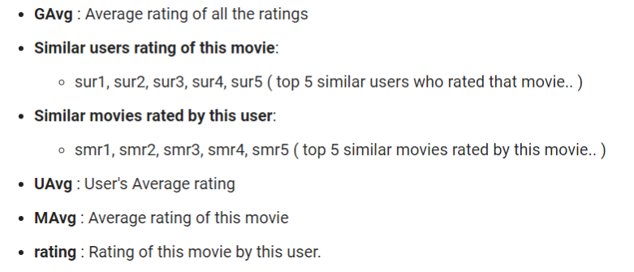
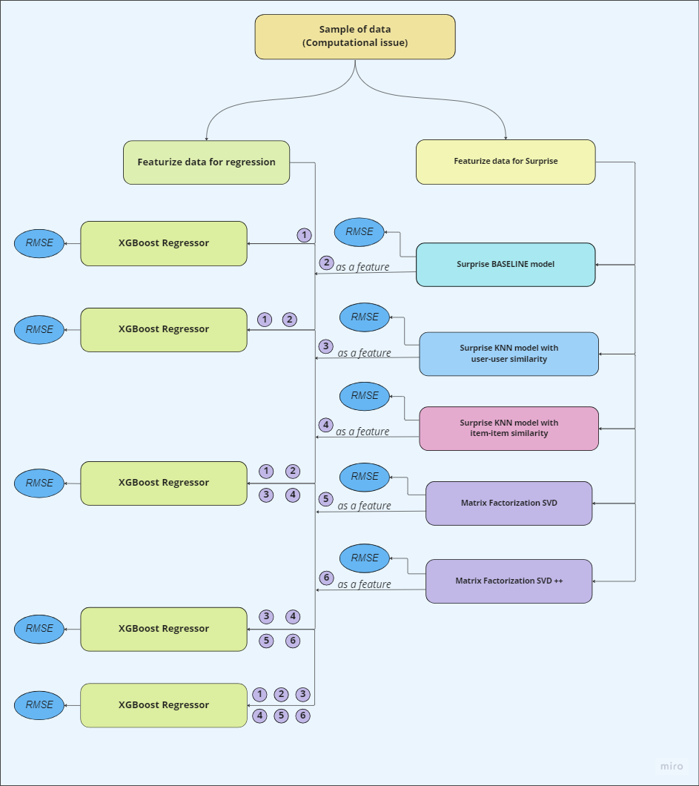

### Recommendation-system-for-Movies
Understand the working of Recommendation system. The end goal was to predict what rating a user would give for a particular movie.

### What is a Recommendation System?
- A recommendation system generates a compiled list of items in which a user might be interested, in the reciprocity of their current selection of item(s). 
  It expands users’ suggestions without any disturbance or monotony, and it does not recommend items that the user already knows.

- For instance, the Netflix recommendation system offers recommendations by matching and searching similar users' habits and suggesting movies that share 
  characteristics with films that users have rated highly.
  
- The recommendation system workflow shown in the diagram above shows the user’s collaboration regarding the ratings of different movies or shows.
  New users get their recommendations based on the recommendations of existing users

### problem Statement
- Netflix provided a lot of anonymous rating data, and a prediction accuracy bar that is 10% better than what Cinematch can do on the same training data set.
  (Accuracy is a measurement of how closely predicted ratings of movies match subsequent actual ratings.)

### Real world/Business Objectives and constraints
- Predict the rating that a user would give to a movie that he ahs not yet rated.
- Minimize the difference between predicted and actual rating (RMSE and MAPE)

### Machine Learning Problem
- given user, movie predict what rating this use would give to this movie 
- This boils down to a Regression problem
-  scale from 1 to 5.
    - Dates have the format YYYY-MM-DD.
    
### Features
    - Below are the features
    
    
### Modelling
  - based on item-item similarity we got similar movies 
  - Below is a list of similar movies for a movie with same genre (DRACULA)
    
  - model tree
    
  - we use Surprise models output as features for XGBoost regressor
  
### References
- https://www.netflixprize.com/rules.html
- https://www.kaggle.com/netflix-inc/netflix-prize-data
- Netflix blog: https://medium.com/netflix-techblog/netflix-recommendations-beyond-the-5-stars-part-1-55838468f429 (very nice blog)
- surprise library: http://surpriselib.com/ (we use many models from this library)
- surprise library doc: http://surprise.readthedocs.io/en/stable/getting_started.html (we use many models from this library)
- installing surprise: https://github.com/NicolasHug/Surprise#installation
- Research paper: http://courses.ischool.berkeley.edu/i290-dm/s11/SECURE/a1-koren.pdf (most of our work was inspired by this paper)
- SVD Decomposition : https://www.youtube.com/watch?v=P5mlg91as1c
